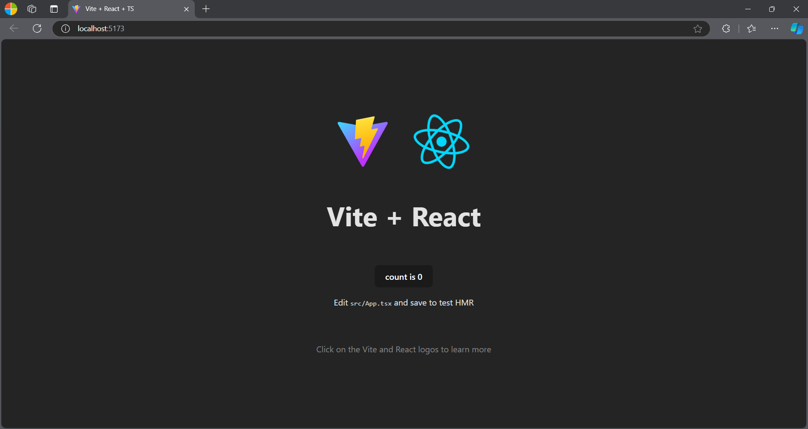
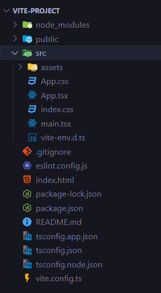

Here's the corrected markdown:

# What is Vite
Vite is a React build tool with advanced features like [Hot Module Replacement](https://vite.dev/guide/features.html#hot-module-replacement) which is an enhancement over native [ES modules](https://developer.mozilla.org/en-US/docs/Web/JavaScript/Guide/Modules).

# What Problem Does Vite Solve
Imagine you are building a website and every time you change something, you have to wait for the entire application to rebuild. Here is where HMR comes in.

**Hot Module Replacement**
- Vite provides an HMR API over native ESM. Frameworks with HMR capabilities can leverage the API to provide instant, precise updates without reloading the page or blowing away application state.

# Quick Start
## Prerequisites
To get started with Vite, make sure you have `node` and `npm` installed on your computer. If you don't have them already, [HERE](https://docs.npmjs.com/downloading-and-installing-node-js-and-npm) is a good start.

## Setup
- Create an empty folder on your desktop (or your preferred location) and open it in the CLI
- Run this command `npm create vite@latest` and hit enter
- It will ask you to choose a name for your project `? Project name: » vite-project`. Enter a name or leave as is and hit enter
- Select React as a framework. Hit enter
```
? Select a framework: » - Use arrow-keys. Return to submit.
    Vanilla
    Vue
>   React
    Preact
    Lit
    Svelte
    Solid
    Qwik
    Others
```
*BTW, FYI React is not a framework, it's a library*

- Choose a variant of your choice. In this case, I'm going with TS. Hit enter

```
? Select a variant: » - Use arrow-keys. Return to submit.
>   TypeScript
    TypeScript + SWC
    JavaScript
    JavaScript + SWC
    Remix ↗
```
- Now `cd` into your project and run these two commands:
    - `npm install` to install all the necessary packages
    - `npm run dev` to run the dev server on http://localhost:5173/
    - Open it in your browser and it will look something like this:

    

- Open your project in your favorite code editor and it should look something like this:



**AND VOILA! You're done with your Vite setup**